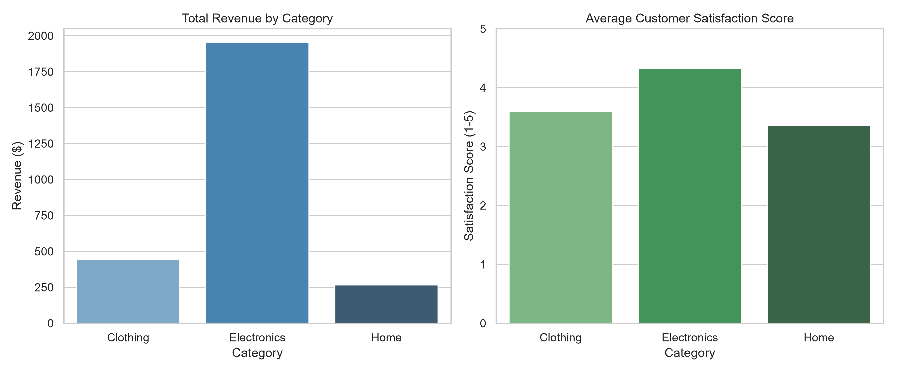

# Hands-On Data Lab: E-Commerce Sales Analysis

Hey everyone! This repository contains my complete work for **Task 2: Hands-On Data Lab Implementation** as part of the **YuvaIntern AI/ML Research Specialist Internship**. 

The main goal of this lab was to get hands-on experience with real-world data processing workflows. Instead of using a perfectly clean dataset, I worked with a custom retail dataset that had typical real-world flaws—like duplicate rows, messy string values mixed inside numeric columns, and missing data points—and built a full end-to-end pipeline using NumPy, Pandas, Matplotlib, and Seaborn.

---

## 📁 Repository Structure

```text
Hands-On-Data-Lab/
│
├── data/
│   ├── raw_retail_data.csv       # Raw synthetic retail sales dataset
│   └── category_insights.png     # Saved Seaborn visualization output
│
├── notebooks/
│   └── 01_hands_on_data_lab.ipynb  # Main Jupyter Notebook containing all code
│
├── .gitignore                    # Version control exclusions
├── requirements.txt              # Required Python packages
└── README.md                     # Project documentation
```

---

## 🛠️ Tech Stack & Environment Setup

- **Language:** Python 3.x
- **Libraries Used:** `pandas`, `numpy`, `matplotlib`, `seaborn`
- **IDE:** Jupyter Notebook / VS Code

### How I set up the environment:
1. First, I initialized the local Git repository and set up the folder structure above.
2. I created `requirements.txt` listing the necessary packages.
3. During setup, I ran into a minor `ModuleNotFoundError` for `matplotlib` and `seaborn` inside the Jupyter Notebook, which I quickly fixed by installing them via `%pip install matplotlib seaborn`.

---

## 🚀 Key Milestones & What I Did

### 1. NumPy Basics & Array Manipulation
Before jumping into DataFrames, I spent time brushing up on core array concepts to make sure I understood vectorization:
- Created 1D and 2D arrays (`arr1d` and `arr2d`).
- Checked fundamental properties like `.shape`, `.ndim`, and `.dtype`.
- Practiced index slicing (extracting specific elements/rows) and reshaped vectors from `(5,)` to `(5, 1)`.
- Applied vectorized math (doubling array values directly without loops) and calculated stats like `mean()`, `sum()`, `std()`, and column sums using `axis=0`.

### 2. Data Cleaning & Preprocessing (Pandas)
I generated a raw retail dataset with intentional errors to practice standard data cleaning steps:
- **Removing Duplicates:** Found transaction ID `108` listed twice. I dropped duplicate rows using `df.drop_duplicates()`, bringing total records from 11 down to 10.
- **Fixing Data Types:** The `Price` column was stored as text/object because someone typed `'missing'` in one row. I replaced `'missing'` with `np.nan` and converted the column to `float64` so I could run calculations on it.
- **Handling Missing Values:**
  - Imputed missing `Category` values using the **mode** (`Electronics`).
  - Imputed missing `Price` and `Quantity` values using their respective **medians**.
  - Imputed missing `Satisfaction_Score` values using the overall column **mean**.
- Confirmed zero null values remained across all columns using `df.isnull().sum()`.

### 3. Feature Engineering & Grouped Aggregations
- **Created a new feature (`Total_Spend`):** Multiplied `Price` by `Quantity` to get total order value for each customer transaction.
- **Overall Spend:** The average spend across all transactions came out to **$265.70**.
- **Grouped Aggregations:** Grouped transactions by `Category` to evaluate business metrics:

| Category | Total Revenue ($) | Avg Satisfaction Score (1-5) | Total Units Sold |
| :--- | :--- | :--- | :--- |
| **Electronics** | **$1,951.00** | **4.32** | **12.0** |
| **Clothing** | **$440.00** | **3.60** | **8.0** |
| **Home** | **$266.00** | **3.35** | **3.0** |

### 4. Exploratory Data Visualization
I generated a 2-panel figure using Seaborn and Matplotlib to summarize key findings visually:
1. **Left Plot:** Bar chart comparing total revenue across categories.
2. **Right Plot:** Bar chart showing customer satisfaction ratings.

The chart was saved directly into the `data/` folder as `category_insights.png`:



---

## 📌 Main Takeaways

- **Electronics is the top driver:** It generated **$1,951.00** in revenue (most units sold) and earned the highest satisfaction rating (**4.32/5**).
- **Home needs attention:** Low sales volume (3 units) and lower satisfaction score (**3.35**) suggest we should look closer at product quality or pricing for home goods.
- **Clean data makes all the difference:** Fixing dirty entries like string placeholders (`'missing'`) early on prevented errors during aggregation and plotting.

---

## 📌 Version Control Checkpoints

I kept my Git history organized by committing work at major project milestones:
1. `feat: initialize repository, setup environment, and numpy array basics`
2. `feat: clean retail dataset, resolve duplicates, cast types, and impute missing values`
3. `feat: complete exploratory visualization and finalize lab analysis`

---

*Project completed as part of YuvaIntern AI/ML Research Specialist Internship.*
